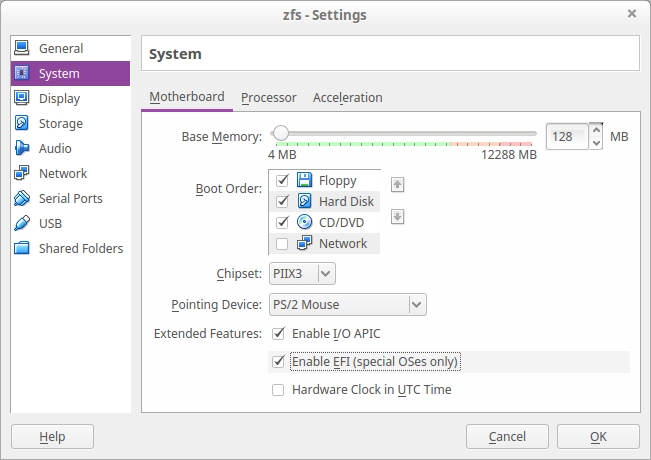

# Install Arch linux in EFI/GPT

## Configure virtualbox

If you do not use virtualbox, you can skip the step.

Set the resolution to 640x480

    $ VBoxManage setextradata "VM name" VBoxInternal2/EfiGopMode 0

Enable `Enable EFI` button

## Partition the disks

layout:

    sdx1: EFI (Hex code: ef00) - 512 M
    sdx2: /                    - 1.5 G

    # gdisk /dev/sda

## Format the partitions

    # mkfs.vfat -F 32 /dev/sda1
    # mkfs.ext4 /dev/sda2

## Mount the partitions

    # mount /dev/sda2 /mnt
    # mkdir -p /mnt/boot/efi
    # mount /dev/sda1 /mnt/boot/efi

## Connect to the Internet

### DHCP

    # systemctl start dhcpcd@your_interface

Setup name server

    # echo nameserver your_nameserver >> /etc/resolv.conf

## Install the base packages

    # vim /etc/pacman.d/mirrorlist
    # pacstrap /mnt base

## Configure the system

    # genfstab -U -p /mnt >> /mnt/etc/fstab
    # arch-chroot /mnt /bin/bash

Set the hostname

    # echo computer_name > /etc/hostname

Set the time zone

    # ln -sf /usr/share/zoneinfo/your_zone/your_subzone /etc/localtime

Uncomment the needed locales in `/etc/locale.gen`, then

    # locale-gen
    # echo LANG=your_locale > /etc/locale.conf

Set the root password

    # passwd

Make first user (do not do this step if you want to use docker)

    # useradd -m your_name
    # passwd your_name

### Configure Network

DHCP

    # cp /etc/netctl/examples/ethernet-dhcp /etc/netctl
    # vi /etc/netctl/ethernet-dhcp
    Interface=enp0s3
    Connection=ethernet
    IP=dhcp

    # netctl enable ethernet-dhcp

Static IP

    # cp /etc/netctl/examples/ethernet-static /etc/netctl
    # vi /etc/netctl/ethernet-static
    Interface=enp0s8
    Connection=ethernet
    IP=static
    Address=('192.168.56.70/24')
    #Gateway='192.168.56.1'
    DNS=('8.8.8.8')

    # netctl enable ethernet-static

## Install a bootloader

Install to disk

    # pacman -S grub efibootmgr
    # grub-install --target=x86_64-efi --efi-directory=/boot/efi --bootloader-id=grub --recheck
    # grub-mkconfig -o /boot/grub/grub.cfg
    # pushd /boot/efi/EFI
    # mv grub boot
    # mv boot/grubx64.efi boot/bootx64.efi
    # popd

## Install sudo

    # pacman -S sudo vim-minimal
    # visudo
    %wheel ALL=(ALL) ALL

    # usermod -aG wheel your_name

## Reboot

Exit the chroot environment

    # exit

Unmount the partition

    # umount /mnt/boot/efi
    # umount /mnt
    # reboot
